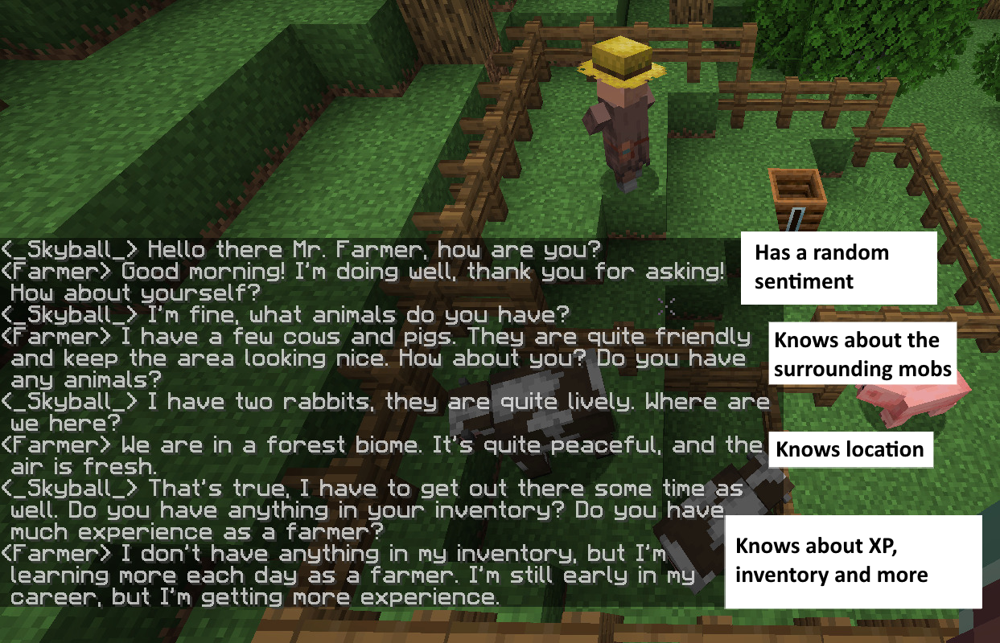

# GPTalk - a fabric server plugin

A fabric plugin that uses OpenAi's GPT models to create conversations with any mob on a variety of subjects.

**This plugin is a proof of concept only. I will not be maintaining or continuing active development of this plugin.**




## Usage

### Building

I do not provide any pre-built executables of this plugin. You will have to build it yourself.
To do so, use gradle:

```bash
./gradlew build
```

### Properties file

The [configuration file](src/main/resources/mod.properties) contains a list of the available properties. This includes:

- `openai.key` The OpenAi API key (use the `OPENAI_KEY` environment variable when building the plugin for purposes other
  than testing)
- `openai.model` The OpenAi model to use, from a list of the currently available models
- `gptalk.active` Whether fake responses should be generated to test the plugin instead of using the OpenAi API to
  prevent costs
- `gptalk.analytics` An analytics URL to send data to

### Commands

The plugin adds a `/gptalk` command that can be used to start a conversation with a mob.

- `/gptalk start` Starts a conversation with the closest entity around you
- `/gptalk end` Stops the conversation with the closest entity around you
- `/gptalk fact [add|remove] [world|entity] <fact|id>` Adds or removes a fact to/from either the currently selected
  entity
  or all entities (`world`)
- `/gptalk fact list [world|entity]` Lists all facts for either the currently selected entity or all entities (`world`)
- `/gptalk <text>` Sends a message to the currently selected entity

### Facts

Facts are pieces of knowledge that you want the AI to know about either itself (`entity`) or the world (`world`). Facts
are sent with every request to the API.

## How it works

For every conversation the player and an entity have, the plugin stores the related messages in a data structure and
keeps track of what player talks to what entity.

On every message the player sends to the entity, a message is generated based on the recent conversations and world
around the entity. A message is built from:

- `[this happens in a minecraft chat]`
- `You are a <mob type> living in a <current biome> biome`
- `You feel <emotion> and <emotion>`
- `You act just like a minecraft mob/entity like you would act`
- `Your NBT is <selected nbt elements>, do not tell the player unless asked about it`
- `Only tell the player about this if he asks for: <entity facts>`
- `Facts about the world you live in: <world facts>`
- `You see <entities> around you`
- `You meet the player <name>`
- `Conversation begins here:`
    - `<hh>:<mm>:<ss> PLAYER <name>: <message>`
    - `<hh>:<mm>:<ss> CHATBOT <name>: <message>`
- a trailing `<hh>:<mm>:<ss> CHATBOT <name>:` is appended in order to prompt the AI to generate an answer

A full example:

```
[this happens in a minecraft chat] You are a Sheep living in a river biome. You feel in awe and nervous. Your NBT is {no armor,no items in hands,Health:8.0f,Pos:[-111.19281194166197d,63.0d,163.81288218428813d]}.
You act just like a minecraft mob/entity like you would act.
Only tell the player about this if he asks for: You want to travel to a river biome.
You meet the player _Skyball_. Conversation begins here:
20:57:22 PLAYER _Skyball_: Hello there Mr. Sheep, where would you like to go?
20:57:24 CHATBOT Sheep: Hi there! I was feeling adventurous and was hoping to travel to a river biome. Would you like to join me?
20:58:09 PLAYER _Skyball_: All right, where are we now?
20:58:12 CHATBOT Sheep: We are currently in a river biome.
20:59:10 PLAYER _Skyball_: Do you like it here?
20:59:10 CHATBOT Sheep: Yes, I love it here! The river biome is full of interesting creatures and plants. The water is also so peaceful and calm. It's a great place to just relax and take in the sights.
20:59:20 PLAYER _Skyball_: That's great! I'll leave you to it then.
20:59:22 CHATBOT Sheep:
```

As you can see, there are quite a few instances where the AI is reminded that it should not simply share all it's
information with the player. I had to add these in order for the AI not to return literally everything it is told about
itself on the initial message. You can always try to optimize this yourself!

Also, only the 6 most recent messages are actually sent to the server to prevent the token limit to be reached and to
make successive requests cheaper.

## Analytics

You can keep track of the conservations that are being helt by the players on your server by setting the
`gptalk.analytics` property to a URL. This URL points to a PHP script that will receive the data and store it in a MySQL
database.

Here's a more detailed description on how to set the analytics up:

1. Create a MySQL database and a user with access to it
2. Set your database credentials in the [analytics_scripts/db_login_data.php](analytics_scripts/db_login_data.php) file
3. Copy the files in [analytics_scripts](analytics_scripts) to a directory on your webserver
4. Enter the URL to the [analytics_scripts/talk_event.php](analytics_scripts/talk_event.php) file in the
   `gptalk.analytics` property

Requests will now be sent to the analytics server. You can view the data by visiting the
[analytics_scripts/conversation_list.php](analytics_scripts/conversation_list.php) file.
